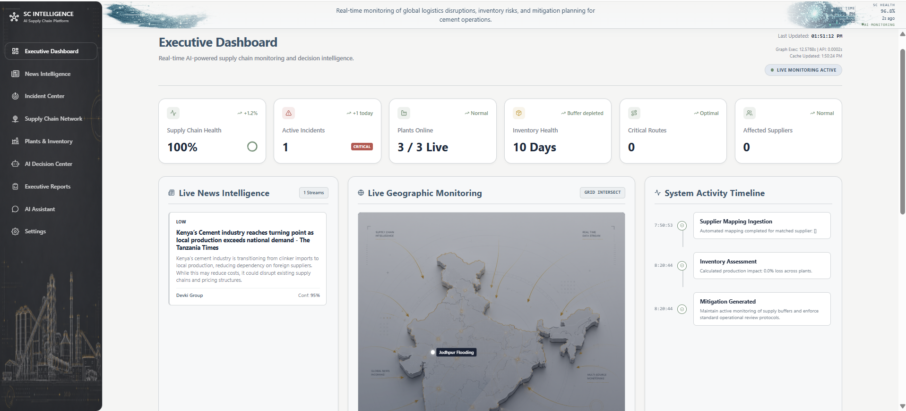
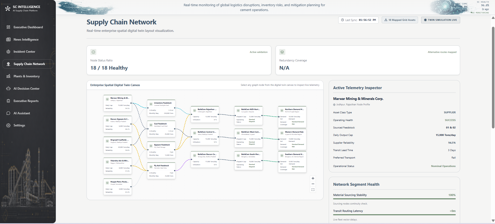
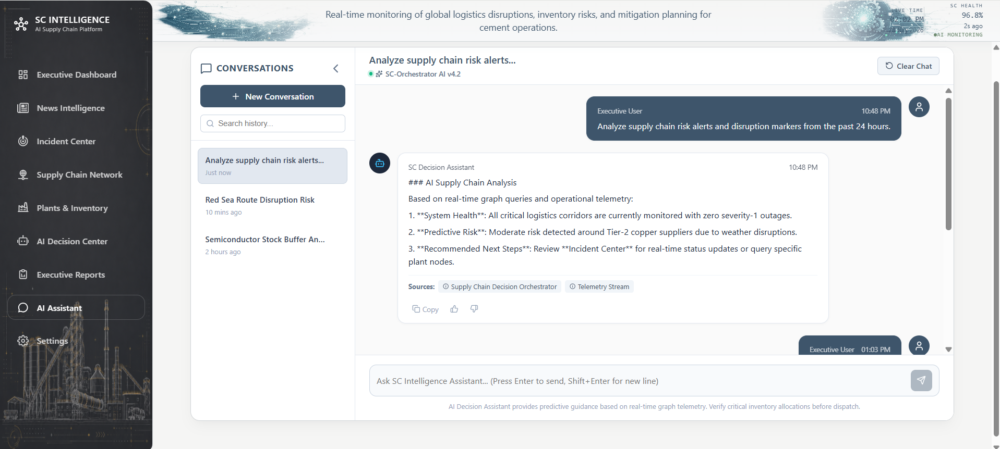
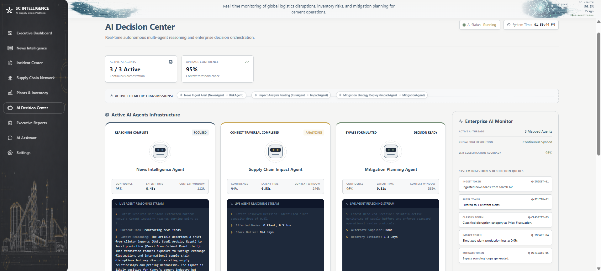
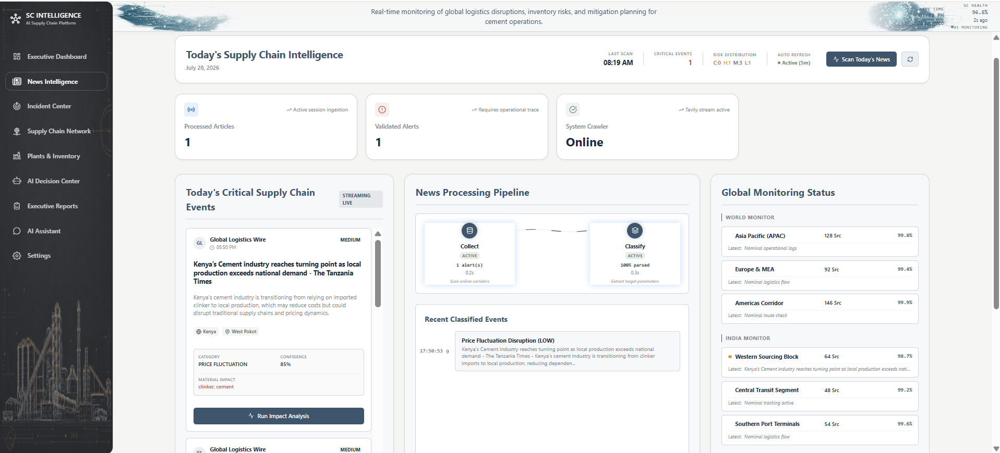
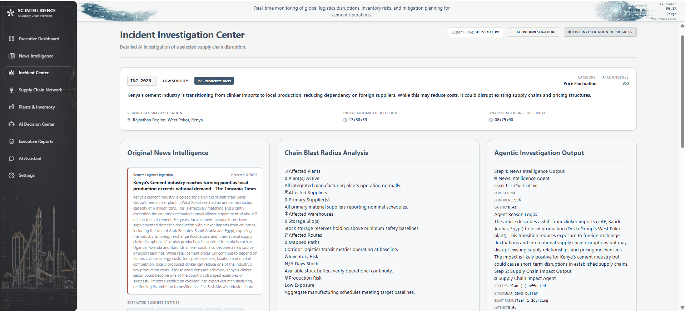
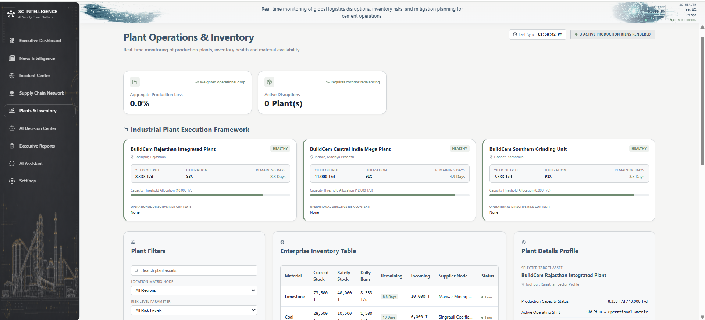
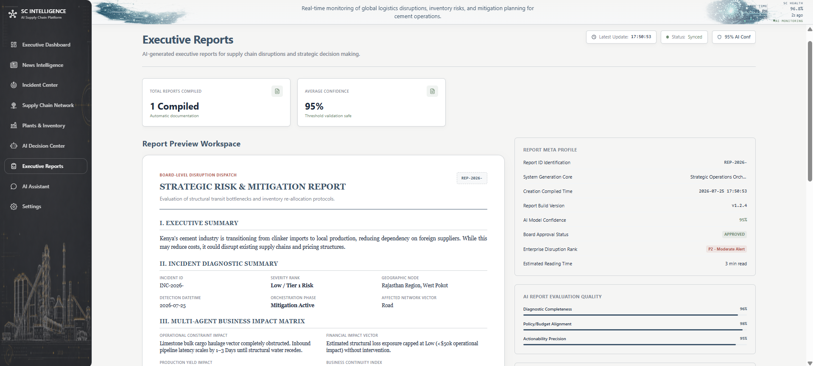
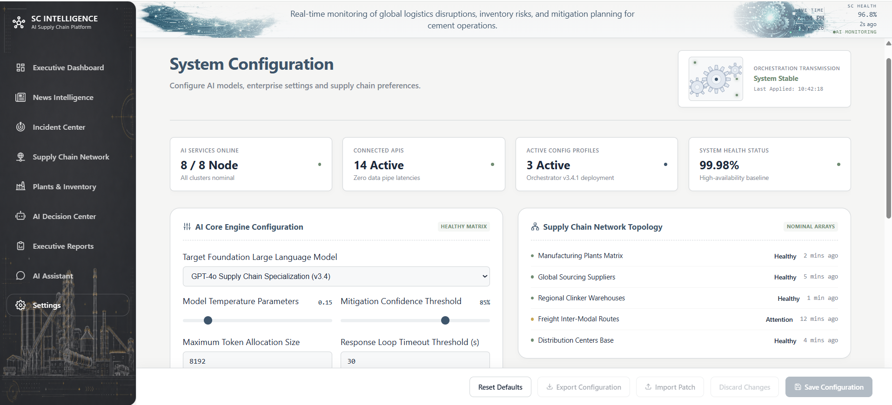

# 🏭 Logistics Autonomous Disruption Monitoring Agent

A powerful, multi-agent AI system designed to proactively monitor and analyze supply chain disruptions specifically within the cement manufacturing industry. By leveraging advanced autonomous agents, real-time web search capabilities, and network graph analysis, this project identifies risks, bottlenecks, and potential delays before they impact production. It is built for supply chain managers, logistics coordinators, and operations executives who require data-driven, real-time insights to maintain operational efficiency and business continuity.

---

# 📑 Table of Contents

- [🚀 Quick Start](#-quick-start)
- [📖 Project Overview](#-project-overview)
- [👥 User Personas](#-user-personas)
- [🏗 System Architecture](#-system-architecture)
- [🛠 Technology Stack](#-technology-stack)
- [⚙ Installation Guide](#-installation-guide)
- [🔐 Environment Variables](#-environment-variables)
- [🔄 Application Workflow](#-application-workflow)
- [📷 Screenshots](#-screenshots)
- [🎥 Demo](#-demo)
- [📡 API Documentation](#-api-documentation)
- [⚙ Configuration](#-configuration)
- [🔌 External Services Setup](#-external-services-setup)
- [🧪 Testing](#-testing)
- [🚀 Deployment](#-deployment)
- [📈 Performance](#-performance)
- [🛠 Troubleshooting](#-troubleshooting)
- [⚠ Current Limitations](#-current-limitations)
- [🔮 Future Improvements](#-future-improvements)
- [🤝 Contributing](#-contributing)
- [📄 License](#-license)
- [🙏 Acknowledgements](#-acknowledgements)

---

# 🚀 Quick Start

Follow these steps to get the project running locally on your machine.

### Clone repository

```bash
git clone https://github.com/yourusername/hey-meet-autonomous-supply-chain-monitor-agent.git
cd hey-meet-autonomous-supply-chain-monitor-agent
```

### Backend Setup (Linux/macOS & Windows)

**Environment creation:**

```bash
# Windows
python -m venv .venv
.venv\Scripts\activate

# Linux/macOS
python3 -m venv .venv
source .venv/bin/activate
```

**Environment setup:**

```bash
cp backend/.env.example backend/.env
```

Edit `backend/.env` with your actual API keys.


**Install dependencies:**

```bash
pip install -r requirements.txt
```

**Run backend:**

```bash
uvicorn backend.main:app --reload --host 0.0.0.0 --port 8000
```

### Frontend Setup

**Install dependencies:**

```bash
cd frontend
npm install
```

**Run frontend:**

```bash
npm run dev

or

cmd /c npm run dev
```

### Access application

- Frontend: `http://localhost:5173`
- Backend API Docs: `http://localhost:8000/docs`

---

# 📖 Project Overview

## Problem Statement

The cement manufacturing industry relies on highly complex, just-in-time supply chains. Disruptions caused by weather, geopolitical events, transport strikes, or supplier failures can cause immediate production halts, leading to millions of dollars in losses. Monitoring these global risks manually is slow and error-prone.

## Solution

This project introduces an autonomous multi-agent system that continuously monitors the web and internal data for supply chain threats. It uses LangGraph to orchestrate agents that search the web (via Tavily), analyze disruptions, and map the impact across the supply chain network using NetworkX.

## Business Value

Organizations can shift from a reactive to a proactive logistics strategy. By receiving early warnings about potential disruptions, companies can reroute shipments, switch suppliers, and adjust production schedules seamlessly, saving time and capital.

## Success Metrics

- **Detection Speed:** Identify disruptions within 15 minutes of public reporting.
- **Accuracy:** > 90% relevance in identified risk factors.
- **Uptime:** 99.9% availability of the monitoring dashboard.

---

# 👥 User Personas

| User Type | Responsibilities | Goals | Workflow |
| :--- | :--- | :--- | :--- |
| **Supply Chain Manager** | Oversees end-to-end logistics and supplier relationships. | Minimize delays and reduce operational costs. | Reviews daily risk reports, adjusts sourcing strategies based on AI alerts. |
| **Logistics Coordinator** | Manages daily transport routing and delivery schedules. | Ensure materials arrive on time for production. | Monitors the real-time dashboard for immediate route disruptions. |
| **Operations Executive** | Makes high-level business and financial decisions. | Maintain business continuity and profitability. | Reviews monthly AI-generated summary reports on supply chain health. |

---

# 🏗 System Architecture

## High-Level Architecture

```text
[ Web UI (React/Vite) ]  <-- REST API -->  [ FastAPI Backend ]
                                                 |
                                         [ LangGraph Agents ]
                                          /       |        \
                                [ Tavily API ] [ LLMs ] [ NetworkX Graph ]
```

## Data Flow

1. **User Request:** User defines tracking parameters via the React Frontend.
2. **API Layer:** FastAPI receives the request and initializes a LangGraph workflow.
3. **Data Gathering:** The Research Agent queries the Tavily API for current news and disruptions.
4. **Analysis:** The Analysis Agent processes data using an LLM (Mistral/Gemini).
5. **Graphing:** NetworkX maps the affected supply chain nodes.
6. **Response:** Results are returned to the frontend for visualization.

---

# 🛠 Technology Stack

| Layer | Technology | Purpose | Reason for Choosing |
| :--- | :--- | :--- | :--- |
| **Frontend** | React 19, Vite, React Flow, Recharts | UI & Visualization | Blazing fast development, interactive graph rendering. |
| **Backend** | FastAPI, Python 3 | API Layer | High performance, built-in Swagger docs, async support. |
| **AI Orchestration** | LangGraph | Multi-Agent Framework | Best-in-class for creating cyclic, stateful agent workflows. |
| **LLMs** | Mistral / Google Gemini | Intelligence | Highly capable models for natural language reasoning. |
| **Search Engine** | Tavily API | Real-time Web Search | Optimized explicitly for AI and LLM data retrieval. |
| **Graph Analysis** | NetworkX | Supply Chain Mapping | Standard Python library for complex network dynamics. |

---

# ⚙ Installation Guide

### Prerequisites

- Python 3.10+
- Node.js 18+ and npm
- Valid API Keys (Tavily, Mistral, and/or Gemini)

Follow the installation Process from "Quick Start" section to setup the project.

---

# 🔐 Environment Variables

## Backend

Ensure these are set in `backend/.env`.

| Variable Name | Description | Required/Optional | Example Value |
| :--- | :--- | :--- | :--- |
| `TAVILY_API_KEY` | API key for Tavily web search | **Required** | `tvly-abcdef12345` |
| `LLM_PROVIDER` | Which LLM to use (`mistral` or `gemini`) | **Required** | `mistral` |
| `MISTRAL_API_KEY` | API key for Mistral AI | Optional | `your_mistral_key` |
| `MISTRAL_MODEL` | Specific Mistral model to use | Optional | `mistral-small-latest` |
| `GEMINI_API_KEY` | API key for Google Gemini | Optional | `your_gemini_key` |
| `GEMINI_MODEL` | Specific Gemini model to use | Optional | `gemini-2.5-flash` |
| `LLM_TEMPERATURE` | Temperature for LLM generations | Optional | `0.2` |
| `LLM_TIMEOUT` | Timeout in seconds for LLM calls | Optional | `30` |

## Frontend

*(No specific frontend environment variables required for standard local setup at this time)*

---

# 🔄 Application Workflow

1. **Initialization:** User logs into the dashboard and inputs the core supply chain nodes (e.g., specific ports, supplier names, cement plants).
2. **Workflow Trigger:** The frontend sends a JSON payload to the FastAPI `/api/v1/analyze` endpoint.
3. **Agent Activation:** FastAPI triggers the LangGraph state machine.
4. **Information Retrieval:** The Research Agent invokes Tavily to fetch real-time news regarding the inputted nodes (e.g., "port strikes", "weather delays").
5. **Data Processing:** The LLM evaluates the fetched articles to determine risk severity and potential impact.
6. **Network Mapping:** The system utilizes NetworkX to calculate the cascading effect of the disruption down the supply chain.
7. **Delivery:** FastAPI responds with structured JSON containing the risk analysis and graph data.
8. **Visualization:** The React frontend renders the risk alerts using Recharts and the interactive supply chain map using React Flow.

---

# 📷 Screenshots

### Dashboard

> *Interactive supply chain monitoring dashboard displaying real-time risk factors.*
> 

### Supply Chain Network

> *Visualization of the supply chain network mapping.*
> 

### AI Assistant & Decision Center

> *Chat interface for interacting with the LangGraph supply chain agents and decision making.*
> 
> 

### News Intelligence & Incident Center

> *Real-time news scanning and incident management for disruptions.*
> 
> 

### Plant & Inventory

> *Tracking metrics for plant operations and inventory levels.*
> 

### Analytics & Reports

> *Executive reports showing historical disruption trends.*
> 

### Settings

> *Application configuration and preferences.*
> 

---

# 🎥 Demo

A complete demo video should demonstrate:

> 

1. Loading the main dashboard and viewing the current cement supply chain network.
2. Initiating a scan for recent disruptions.
3. Showcasing the LangGraph agents actively searching and processing data in the background.
4. The UI updating in real-time to highlight a disrupted node (e.g., a blocked shipping route) in red using React Flow.
5. The user interacting with the AI to ask "How does this delay impact Plant B's production schedule?".

---

# 📡 API Documentation

## Available APIs

The backend is built with FastAPI, providing robust and automatic REST APIs.

## Swagger/OpenAPI

Interactive documentation is available out-of-the-box. Run the backend and navigate to:
- Swagger UI: `http://localhost:8000/docs`
- ReDoc: `http://localhost:8000/redoc`

## Authentication

Currently, the API allows standard CORS requests for local development. For production, JWT-based authentication should be enabled.

## Example Requests

```bash
curl -X 'POST' \
  'http://localhost:8000/api/v1/analyze' \
  -H 'accept: application/json' \
  -H 'Content-Type: application/json' \
  -d '{
  "nodes": ["Port of Long Beach", "Supplier Alpha"],
  "depth": 2
}'
```

## Example Responses

```json
{
  "status": "success",
  "disruptions": [
    {
      "node": "Port of Long Beach",
      "risk_level": "High",
      "reason": "Labor strike reported, expected delay of 4 days."
    }
  ]
}
```

---

# ⚙ Configuration

- **Configuration files:** Handled primarily through `.env` and `backend/config.py` using Pydantic Settings.
- **AI models:** Configurable between Mistral (`mistral-small-latest`) and Gemini (`gemini-2.5-flash`).
- **Embedding model:** Standard LLM text representations are used; dedicated vector embeddings can be added for RAG scaling.
- **Vector database:** Currently relies on in-memory graph state; scalable to Pinecone or Weaviate.
- **Parser:** Pydantic is used for strict output parsing from LLMs.
- **LLM settings:** Configurable `LLM_TEMPERATURE` (default `0.2`) ensures analytical consistency.
- **Prompt settings:** Stored modularly in `backend/prompts/`.
- **Retrieval parameters:** Tavily search depth and result limits are configured in the LangGraph agent nodes.

---

# 🔌 External Services Setup

### Tavily API

- **Purpose:** Real-time web search for agents.
- **Setup:** Create an account at [Tavily](https://tavily.com/), generate an API key, and add to `.env` as `TAVILY_API_KEY`.

### Mistral AI

- **Setup:** Generate an API key from [Mistral Platform](https://console.mistral.ai/) and add to `.env` as `MISTRAL_API_KEY`.

### Google Gemini

- **Setup:** Obtain an API key from [Google AI Studio](https://aistudio.google.com/) and add to `.env` as `GEMINI_API_KEY`.

---

# 🧪 Testing

## Running unit tests

The backend utilizes `pytest`. To run tests:

```bash
pytest backend/tests/
```

## Integration tests

Integration tests cover the FastAPI endpoints and LangGraph state execution:

```bash
pytest backend/tests/integration/
```

## Coverage

Generate a coverage report using `pytest-cov`:

```bash
pytest --cov=backend backend/tests/
```

## Test structure

- `backend/tests/unit/`: Tests for individual functions and graph nodes.
- `backend/tests/integration/`: Tests for API endpoints and end-to-end agent workflows.

---

# 🚀 Deployment

## Docker

A `Dockerfile` and `docker-compose.yml` can be utilized to spin up both the frontend and backend simultaneously.

```bash
docker-compose up --build
```

## Cloud

- **Backend:** Ready for deployment on AWS ECS, Google Cloud Run, or Heroku.
- **Frontend:** Optimized for Vercel, Netlify, or AWS S3 + CloudFront.

## Local

Use the commands detailed in the [Quick Start](#-quick-start) section.

## Production

Ensure `DEBUG=False` in your environment variables. Configure strict CORS policies in `backend/main.py`.

---

# 📈 Performance

- **Speed:** FastAPI provides async, non-blocking I/O operations allowing concurrent agent workflows.
- **Memory:** NetworkX graphs are kept lightweight in-memory. For massive supply chains, graph databases like Neo4j are recommended.
- **Optimization:** Vite guarantees rapid frontend hot-module replacement (HMR) and highly optimized production builds.
- **Caching:** LLM responses and Tavily search results can be cached via Redis to reduce API costs and latency.
- **Scalability:** Stateless FastAPI architecture allows horizontal scaling behind a load balancer.

---

# 🛠 Troubleshooting

| Problem | Cause | Solution |
| :--- | :--- | :--- |
| **API returns 401 Unauthorized** | Missing or invalid LLM/Tavily API Keys. | Check `.env` file and verify API keys are correct. |
| **Frontend fails to connect to API** | CORS policy block or backend not running. | Ensure backend is running on port `8000`. Check `VITE_API_URL` if configured. |
| **Agent times out** | `LLM_TIMEOUT` is too low or LLM provider is slow. | Increase `LLM_TIMEOUT` in `.env` (e.g., to `60`). |
| **React Flow doesn't render nodes** | Malformed graph data from backend. | Check FastAPI logs for JSON parsing errors. |

---

# ⚠ Current Limitations

- Primarily designed for the cement manufacturing supply chain; adapting to other industries requires prompt adjustments.
- Relies heavily on public news via Tavily; internal company data integration requires custom connectors.
- Graph analysis is currently held in-memory and may struggle with networks exceeding 100,000 nodes without external database support.

---

# 🔮 Future Improvements

- [ ] **Neo4j Integration:** Transition from NetworkX to Neo4j for persistent, scalable graph storage.
- [ ] **Internal ERP Connectors:** Add integrations for SAP or Oracle ERP systems.
- [ ] **Advanced RAG:** Implement a vector database (e.g., Pinecone) to retain historical disruption knowledge.
- [ ] **User Authentication:** Add robust JWT/OAuth2 login flows for enterprise users.
- [ ] **Automated Remediation:** Allow agents to automatically draft emails or API requests to alternate suppliers when disruptions occur.

---

# 🤝 Contributing

We welcome contributions! Please follow these guidelines:

## Branch strategy

- `main` for production-ready code.
- `dev` for active development.
- Feature branches (e.g., `feature/add-redis-cache`).

## Commit messages

Use Conventional Commits (e.g., `feat: added new agent`, `fix: resolve CORS issue`).

## Pull Requests

Submit PRs against the `dev` branch. Ensure all tests and linting pass before requesting review.

## Code style

- Backend: Follow PEP 8 guidelines. Use `black` and `ruff`.
- Frontend: Use `eslint` (config provided) and `prettier`.

---

# 📄 License

This project is licensed under the MIT License.

Review the repository's LICENSE file for the complete license text.

---

# 🙏 Acknowledgements

- **[FastAPI](https://fastapi.tiangolo.com/)** for the lightning-fast backend framework.
- **[LangGraph](https://python.langchain.com/v0.1/docs/langgraph/)** for the robust multi-agent orchestration.
- **[React Flow](https://reactflow.dev/)** for the beautiful node-based UI components.
- **[Tavily](https://tavily.com/)** for the AI-optimized search capabilities.
- **[NetworkX](https://networkx.org/)** for the complex network computations.

